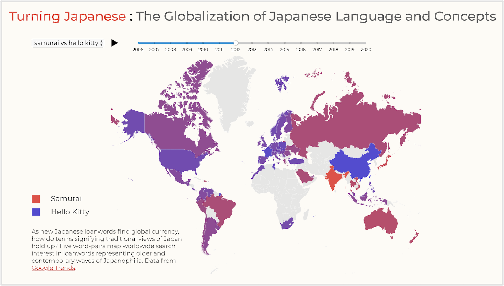

# Turning Japanese: The Globalization of Japanese Language and Concepts  
## MS in Data Visualization, Parsons School of Design

## Abstract
In August 1945, Japan lay a smoldering ruin, its military defeated, and great cities bombed to oblivion. Yet within one generation, the nation was the world’s number two economy, and within two, a global soft power. This thesis investigates the process whereby Japan became a cultural giant, what it means for the world, for the West in particular, and also for Japan itself. For the world, Japan can provide signals on what the economic rise of other Asian nations portends in terms of their own soft power. At a time when Asia represents two-thirds of global economic growth and Asians are the United States’ fastest growing immigrant group, the stakes are high.  For Asians, opportunities arise for governments to leverage soft power, and for culture industries to increase their reach worldwide. For Westerners, opportunities come in the form of enriched experiences in every sector from food to film, accompanied by risks of misunderstanding as Western societies turn inward and Western culture becomes less preeminent. With these shifts in mind, this thesis uses language as a vector to explore Japanese soft power, probing how publicly available textual data can be mined to quantify and visualize shifting cultural influence, a technique it is hoped can provide insight not only into the question of Asian soft power, but into the larger problem of how to understand cultural interactions.

 

## Acknowledgements
This thesis would not have been possible without the guidance of the Parsons MSDV faculty. Special thanks are due to Daniel Sauter, Aaron Hill, Richard The, Alec Barrett, Alvin Chang, Jonathan Thirkield and Christian Swinehart. In addition, invaluable programming assistance was provided by Robert Abarbanel, and linguistic expertise by Schun Doi. Finally, I am grateful to the Parsons MSDV classes 2019 and 2020 for their encouragement and intellectual exchange, and to my family for their unwavering support. 

